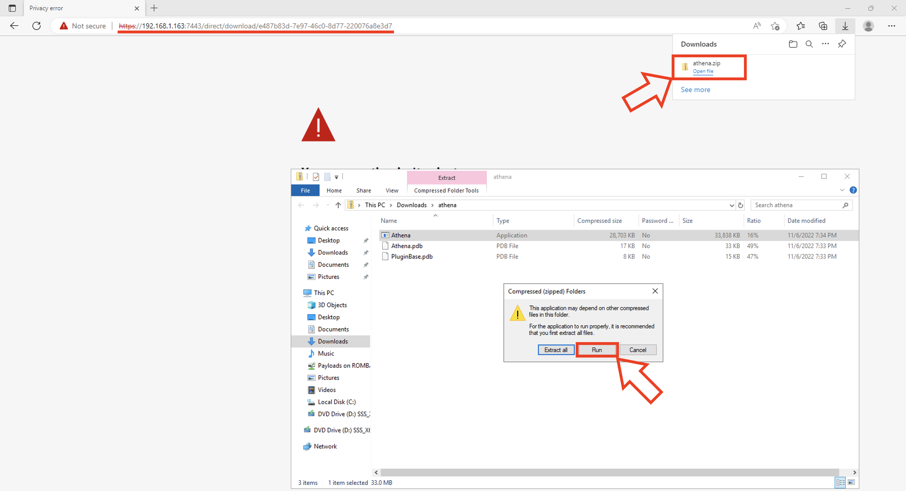

# Running the Agent on a Victim and Executing Commands

### Disclaimer:
As Mythic and its C2 agents are considered malware, please do not install or run them on "Production" systems.

## Running and Interacting with Athena

With the payload generated from the [previous step](payload.md) there are multiple ways to serve it to the victim.
<br/><br/>

There exist may ways of potentially sending the payload to the victim (e.g. sending it via RDP Shared Folder, Remote SMB/NTFS/OneDrive partition, 3rd party sites that host files (Pastebin, Github, etc.), etc.), but in this case the simplest way would be to:
- download payload to a server with IP reachable by the victim
- host a http server

As our test Windows VM reaches the Mythic Server, we can serve the payload directly via a direct download link provided by Mythic.
<br/><br/>

We can find the download link for the payload by right-clicking on the "Download" option of a generated payload and selecting the "Copy Link" option.


Note: The direct download link should be in a form similar to "https://192.168.1.163:7443/direct/download/e487b83d-7e97-46c0-8d77-220076a8e3d7".
<br/><br/>

Now, we can access the test Windows VM, download "athena.zip", access the zip and run the agent.



With the active callback returned by Athena we can proceed to load the "shell" functionality in order to run arbitrary commands on the system.

```
load shell
shell whoami
```


## Additional Exercises
With the Athena agent we can further explore its functionalities by:
- Using the "upload" and "download" features
- Using "load" to load more functionalities (you just write "load" and press enter in the task input and a pop-up containing a dropdown of all possible modules will appear)

Advanced Exercise:
- explore the "socks" feature to forward traffic (note: set "sleep" to 0 to properly use socks)
- use the "load-assembly" and "execute-assembly" features to load .NET DLLs in memory and run malicious executables (e.g. Mimikatz)

Red Exercise:
- Try serving your agent via the HTML Smuggling technique (you can find an example at the following link https://hacklikea.red/file.html).
- Use a packer to bypass MOTW and/or AVs (e.g. https://github.com/mgeeky/PackMyPayload)
- Use "Right to Left Override Attacks" to make your file look "non-malicious" (e.g. https://cybriant.com/what-is-a-right-to-left-override-attack/)
