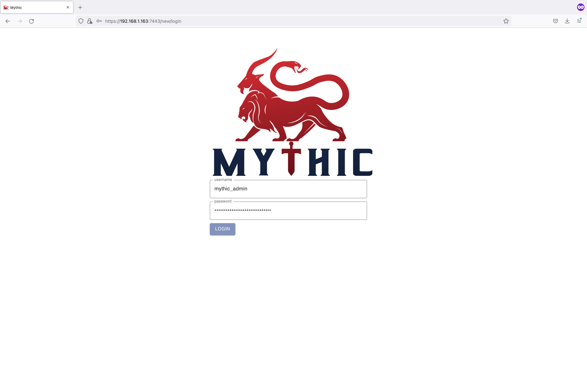
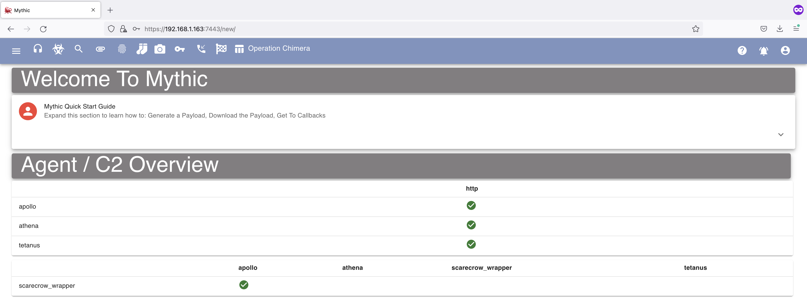

# Installing Mythic on an Ubuntu Machine

Note: Use a Ubuntu machine with at least 50 GB of storage, 2 Cores and 2 MB of RAM on which to install Mythic.

### Disclaimer:
As Mythic and its C2 agents are considered malware, please do not install or run them on "Production" systems.

## Installation on Ubuntu Device

We can use the following commands in order to install the Mythic C2 software 

```
sudo apt-get install git
git clone https://github.com/its-a-feature/Mythic
cd Mythic/
sudo ./install_docker_ubuntu.sh 
sudo ./mythic-cli start
sudo ./mythic-cli install github https://github.com/MythicC2Profiles/http
### Note: Athena requires an internet connection at start-up and restart
sudo ./mythic-cli install github https://github.com/MythicAgents/Athena
sudo ./mythic-cli install github https://github.com/MythicAgents/Apollo
sudo ./mythic-cli install github https://github.com/MythicAgents/tetanus
sudo ./mythic-cli install github https://github.com/MythicAgents/scarecrow_wrapper
sudo service docker restart
sudo ./mythic-cli restart

### Read USER PASS
cat .env | grep 'MYTHIC_ADMIN_'
```

You can now login over "https" on port 7443 with the above credentials.

<br/>

Once installed and logged in you should be greeted by the following screen.


## Additional Exercises
Look through the [Mythic C2 Profiles](https://github.com/MythicC2Profiles) and [Mythic Agents](https://github.com/MythicAgents) github repositories and:
- Install a new Profile
- Install a new Agent