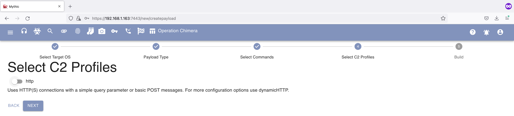
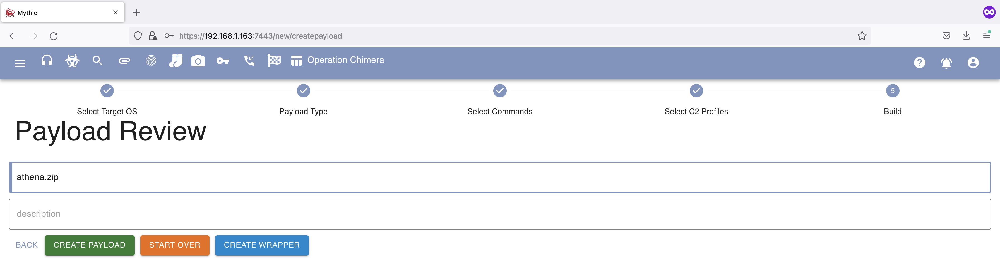

# Generating a Mythic Payload

### Disclaimer:
As Mythic and its C2 agents are considered malware, please do not install or run them on "Production" systems.

## Generating an Athena Payload

For this example we will generate an Athena payload.
  

We will go in the upper-left corner and press on the 3 lines.

From here we can click on "Create" -> "Create Payload".

Select from the dropdown the OS we want to target (in this case Windows).

The type of agent (in this case "Athena").

Select the target architecture (as we are exploiting a 64 bit Windows OS we can select either the win-x64 or win-x86 architecture).

Select the commands/functionalities that will be initially loaded into the Agent (in this case Athena and Tetanus come with a predefined set of functionalities, but for modular agent such as Apollo you need to specify at least and "exit and "load" module).

Select the C2 profile that will be used by the agent (in this case HTTP).

And completing the required information required by the Agent to connect back to our C2 (in this case we will complete the "URL" field with "http://<MYTHIC_IP>" as when installing the HTTP C2 profile it automatically starts itself on port 80).

With all the above steps performed correctly we will be able to generate our Agent by clicking on the "Create Payload" button.

Note: The payload creation process may take a few minutes.

Once the payload is created we can press the "Download" button in order to download our payload from the browser.

## Additional Exercises
Now that you have created an Athena agent, you can have fun creating the following payloads:
- Tetanus EXE Agent
- Apollo EXE Agent
- Apollo Shellcode
- Scarecrow Wrapped payload using the Apollo Shellcode

Advanced Exercise:
- Use a wrapper external to Mythic in order to wrap your executable(s) (e.g. https://github.com/ORCx41/AtomPePacker)
